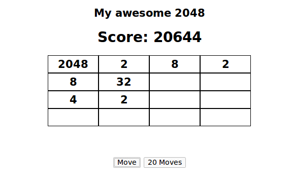

# 2048-ai

Simple ai for 2048 in clojurescript.

Thanks https://github.com/bcarrell/2048-cljs for the game itself.

## Running

    lein figwheel
    # go to browser and open http://127.0.0.1:3449/

## Result

